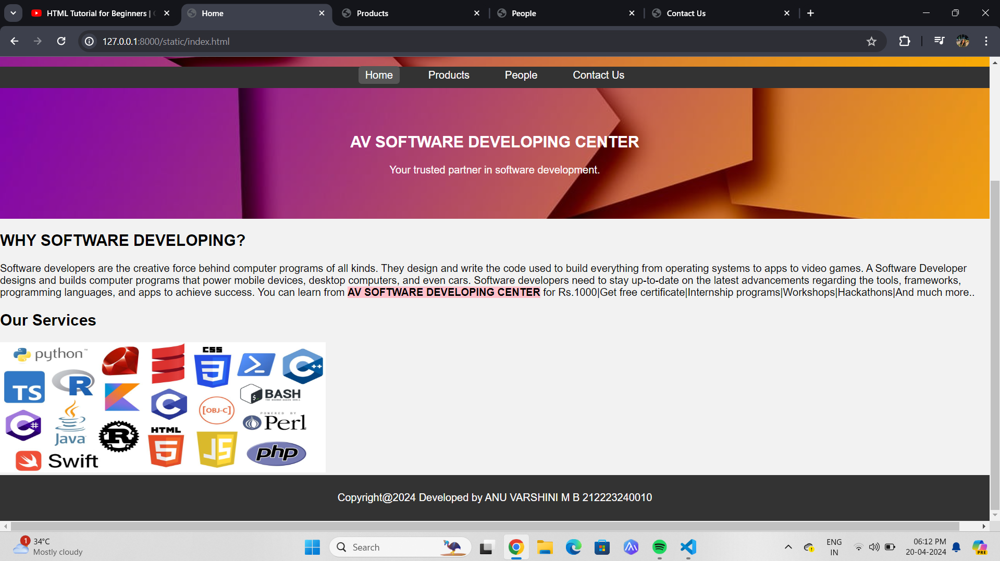
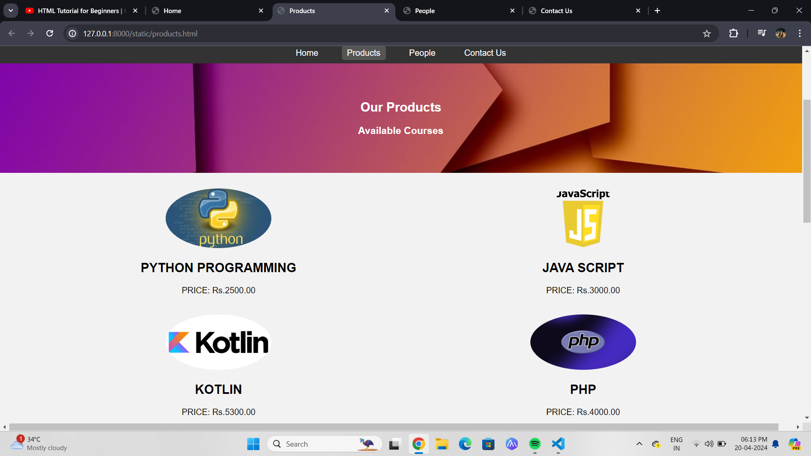
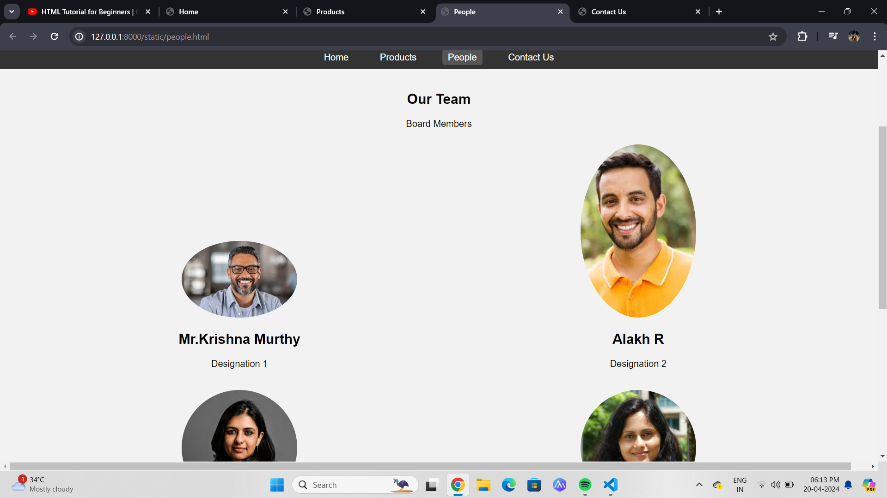
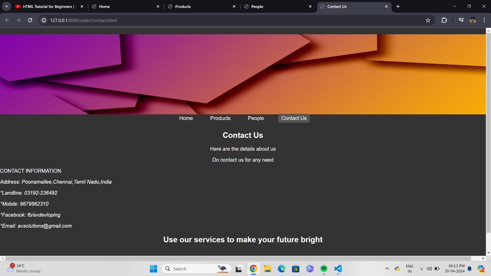

# Ex.07 Software Product Company Website
## Date: 16-04-2024

## AIM:
To develop a static company website to display the softwares and services provided by the company.

## DESIGN STEPS:

### Step 1:
Requirement collection.

### Step 2:
Creating the layout using HTML and CSS.

### Step 3:
Updating the sample content.

### Step 4:
Choose the appropriate style and color scheme.

### Step 5:
Validate the layout in various browsers.

### Step 6:
Validate the HTML code.

### Step 7:
Publish the website in the given URL.

## PROGRAM:
```
index.html
<head>
    <meta charset="UTF-8">
    <meta name="viewport" content="width=device-width, initial-scale=1.0">
    <title>Home</title>
    <link rel="stylesheet" href="styles.css">
    <style>
        .highlight {
            background-color: pink;
        }
    </style>
</head>
<body>
    <header>
        
        <div class="banner-text">
            <nav>
                <a href="index.html" class="active">Home</a>
                <a href="products.html">Products</a>
                <a href="people.html">People</a>
                <a href="contact.html">Contact Us</a>
            </nav>
        </div>
    </header>

    <section class="banner">
        <h1 align="center">AV SOFTWARE DEVELOPING CENTER</h1>
        <p align="center">Your trusted partner in software development.</p>
    </section>

    <section class="about-us">
        <h1>WHY SOFTWARE DEVELOPING?</h1>
        <p>Software developers are the creative force behind computer programs of all kinds. They design and write the code used to build everything from operating systems to apps to video games.
            A Software Developer designs and builds computer programs that power mobile devices, desktop computers, and even cars. Software developers need
            to stay up-to-date on the latest advancements regarding the tools, frameworks, programming languages, and apps to achieve success.
            You can learn from <b><span class="highlight">AV SOFTWARE DEVELOPING CENTER</span></b> for Rs.1000|Get free certificate|Internship programs|Workshops|Hackathons|And much more..
        </p>
    </section>

    <section class="services">
        <h1>Our Services</h1>
        
        <div class="program-text">
    </section>

    <footer>
        <p>Copyright@2024 Developed by ANU VARSHINI M B 212223240010</p>
    </footer>

</body>
</html>
```
```
products.html
<head>
    <meta charset="UTF-8">
    <meta name="viewport" content="width=device-width, initial-scale=1.0">
    <title>Products</title>
    <link rel="stylesheet" href="styles.css">
</head>
<body>
    <header>
        
        <div class="banner-text">
            <nav>
                <a href="index.html">Home</a>
                <a href="products.html" class="active">Products</a>
                <a href="people.html">People</a>
                <a href="contact.html">Contact Us</a>
            </nav>
        </div>
    </header>

    <section class="banner">
        <h1 align="center">Our Products</h1>
        <h3 align="center">Available Courses</h3>
    </section>

    <section class="products">
        <div class="product">
            
            <h2>PYTHON PROGRAMMING</h2>
            <p>PRICE: Rs.2500.00</p>
        </div>
        <div class="product">
            
            <h2>JAVA SCRIPT</h2>
            <p>PRICE: Rs.3000.00</p>
        </div>
        <div class="product">
            
            <h2>KOTLIN</h2>
            <p>PRICE: Rs.5300.00</p>
        </div>
        <div class="product">
            
            <h2>PHP</h2>
            <p>PRICE: Rs.4000.00</p>
        </div>
        <div class="product">
            
            <h2>JAVA</h2>
            <p>PRICE: Rs.3300.00</p>
        </div>
        <div class="product">
            
            <h2>RUBY</h2>
            <p>PRICE: Rs.5500.00</p>
        </div>
        <div class="product">
            
            <h2>C++</h2>
            <p>PRICE: Rs.2200.00</p>
        </div>
        <div class="product">
            
            <h2>C#</h2>
            <p>PRICE: Rs.4450.00</p>
        </div>
        <div class="product">
            
            <h2>Go Language</h2>
            <p>PRICE: Rs.6650.00</p>
        </div>
        <div class="product">
            
            <h2>CSS Language</h2>
            <p>PRICE: Rs.7550.00</p>
        </div>
        <div class="product">
            
            <h2>Swift Language</h2>
            <p>PRICE: Rs.2350.00</p>
        </div>
        <div class="product">
            
            <h2>Type Script</h2>
            <p>PRICE: Rs.5800.00</p>
        </div>
    </section>

    <footer>
        <p>Copyright@2024 Developed by ANU VARSHINI M B 212223240010</p>
    </footer>

</body>
</html>
```
```
people.html
<head>
    <meta charset="UTF-8">
    <meta name="viewport" content="width=device-width, initial-scale=1.0">
    <title>People</title>
    <link rel="stylesheet" href="styles.css">
</head>
<body>
    <header>
        
        <div class="banner-text">
            <nav>
                <a href="index.html">Home</a>
                <a href="products.html">Products</a>
                <a href="people.html" class="active">People</a>
                <a href="contact.html">Contact Us</a>
            </nav>
        </div>
    </header>

    <section class="people">
        <h1 align="center">Our Team</h1>
        <p align="center">Board Members</p>
        <div class="person">
            
            <h2>Mr.Krishna Murthy</h2>
            <p>Designation 1</p>
        </div>
        <div class="person">
            
            <h2>Alakh R</h2>
            <p>Designation 2</p>
        </div>
        <div class="person">
            
            <h2>Charumathi</h2>
            <p>Designation 3</p>
        </div>
        <div class="person">
            
            <h2>Renuka</h2>
            <p>Designation 4</p>
        </div>
        <div class="person">
            
            <h2>Logesh</h2>
            <p>Designation 5</p>
        </div>
        <div class="person">
            
            <h2>Manisha</h2>
            <p>Designation 6</p>
        </div>
    </section>

    <footer>
        <p>Copyright@2024 Developed by ANU VARSHINI M B 212223240010</p>
    </footer>

</body>
</html>
```
```
contact.html
<head>
    <meta charset="UTF-8">
    <meta name="viewport" content="width=device-width, initial-scale=1.0">
    <title>Contact Us</title>
    <link rel="stylesheet" href="styles.css">
</head>
<body>
    <header>
        <header>
            
            <div class="banner-text">
        <nav>
            <a href="index.html">Home</a>
            <a href="products.html">Products</a>
            <a href="people.html">People</a>
            <a href="contact.html" class="active">Contact Us</a>
        </nav>
    </header>

    <section class="contact">
        <h1 align="center">Contact Us</h1>
        <p align="center">Here are the details about us</p>
        <p align="center">Do contact us for any need</p>
        <p>CONTACT INFORMATION</p>
        <address>
            <p>Address: Poonamallee,Chennai,Tamil Nadu,India</p>
            <p>*Landline: 03192-236492</p>
            <p>*Mobile: 9679862310</p>
            <p>*Facebook: fb/avdevloping</p>
            <p>*Email: avsolutions@gmail.com</p>
        </address>
    </section>
    <h2 align="center">Use our services to make your future bright</h2>

    <footer>
        <p>Copyright@2024 Developed by ANU VARSHINI M B 212223240010</p>
    </footer>

</body>
</html>
```
```
styles.css
body {
    font-family: Arial, sans-serif;
    margin: 0;
    padding: 0;
    background-color: #f2f2f2;
}

header {
    background-color: #333;
    color: white;
    padding: 10px 0;
}

nav {
    text-align: center;
}

nav a {
    margin: 0 15px;
    color: white;
    text-decoration: none;
    padding: 5px 10px;
    border-radius: 5px;
}

nav a:hover, nav a.active {
    background-color: #555;
}

.banner {
    text-align: center;
    padding: 50px 0;
    background-image: url('banner.jpg');
    background-size: cover;
    color: white;
}

.banner-text {
    text-align: center;
}

.products, .people {
    text-align: center;
    padding: 20px;
}

.product, .person {
    display: inline-block;
    width: 45%; /* Set width to 45% for a 2x2 grid */
    margin: 10px;
    text-align: center;
}

.product img, .person img {
    max-width: 100%;
    height: auto;
    border-radius: 50%; /* Rounded images */
}

.product h2, .product p, .person h2, .person p {
    text-align: center;
}

footer {
    background-color: #333;
    color: white;
    text-align: center;
    padding: 10px 0;
}
```

## OUTPUT:





## RESULT:
The program for designing software company website using HTML and CSS is completed successfully.
